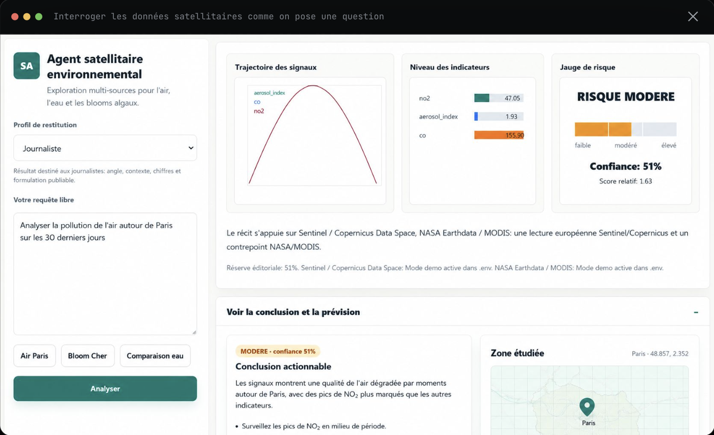

# CHATBOT — Agent conversationnel pour données satellitaires

**Swarm-Agent Conversational Architecture to Empower Non-Experts in Satellite Data Interpretation**

Projet de recherche appliquée (BRGM, 2024–2025) : un agent conversationnel qui permet d'explorer des données environnementales — qualité de l'air, eau, blooms algaux — directement en langage naturel, sans avoir à maîtriser les outils techniques sous-jacents.

## Ce que fait le projet

À partir d'une question posée en langage naturel (ex. « Analyser la pollution de l'air autour de Paris sur les 30 derniers jours »), l'agent adapte sa restitution au profil choisi (journaliste, expert…), interroge les indicateurs disponibles (NO2, CO, aerosol_index, CH4, HCHO…) et restitue une synthèse actionnable avec niveau de confiance et zone étudiée.

## Contenu du dépôt

Le notebook `DATA_SATELLITE_INISTA_GITHUB_v1.ipynb` orchestre les agents et interprète les données. Le fichier `air_quality_stations_daily.csv` contient les données quotidiennes des stations de qualité de l'air. Les fichiers `AER_AI_340_380.json`, `CH4.json`, `CO.json` et `HCHO.json` sont les indicateurs satellitaires par polluant. Le fichier `config_sentinel.ini` configure l'accès aux données Sentinel/Copernicus.

## Utilisation

Étape 1 — Ouvrir `DATA_SATELLITE_INISTA_GITHUB_v1.ipynb` dans Jupyter ou Google Colab. Étape 2 — Renseigner une clé API OpenAI. Étape 3 — Charger les fichiers de données satellitaires fournis dans le dépôt. Étape 4 — Exécuter les cellules pour lancer l'agent conversationnel.

## Contexte

Développé dans le cadre d'un programme de recherche appliquée avec le BRGM (2024–2025), autour des données satellitaires (Sentinel/Copernicus, NASA Earthdata/MODIS) et de leur restitution en langage naturel pour des utilisateurs non experts.
